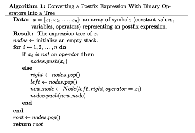

# Project 4 of PLC

 Write a main Haskell program for matching strings using regular expressions. There are many important algorithms and libraries that do this. The purpose of the assignment is not use those in order to get all the test cases correct, but to write simple recursive functions and data in Haskell.

One interesting matching algorithm uses regular-expression derivatives. It is explained with great imagination, great detail, and in Haskell, in a blog. The assignment is to prove you read and understand the blog. Failing a test case is merely a bug, deviating from the approach shows a lack of understanding.

If you can't write a simple Haskell program and understand the blog, ask for help, copying sophisticated Haskell code is not going to help. If you want to learn other great things, then read the books, listen to the videos, write other Haskell programs at Kattis, for example.

To prove that you understand the blog will we add two additional regular expression operators: one-or-more and optional. You may add others if you like. The alphabet will be lower-case letters `a-z`. The required regular expression operators are: 

```
∅ empty    U+2205 Empty Set
ε epsilon  U+03B5 Greek Small Letter Epsilon
|      alternation   [binary operation]
+      one or more   [unary operation]
*      Kleene Star   [unary operation]
?      optional      [unary operation]
@      concatenation [binary operation]
```

The main difficulty will be to read the regular expressions. These will be given in postfix form as there is an easy recursive function to do it. Here is the pseudo code of a imperative algorithm you can modify to fit the needs of the project.



# Input / Output

The program should get its input from the standard input stream. The input is any number of lines of UTF8 text. Each line is a legal postfix expression representing a regular expression. and a legal string over the alphabet. The two are separated by one or more spaces. A string may consist solely of the Unicode code point U+03B (epsilon), this stands for the string with no characters in it. Your program is not required to perform input validation.

For every line of input, write one line to the standard output stream. Output the word 'yes' if the regular expression matches the entire string, 'no' otherwise. 

## Sample Input 1
```
ab@    a
ch@    ch
ab@b|  a
a*     ε
```
## Sample Output 1
```
no
yes
no
yes
```

## Sample Input 2
```
a?     a
a?     ε
a?     ab
aab|@*  ababababa
aab|@*  ababababab
aab|@*  babababab
∅b|*ab@c@ε|@      c
∅b|*ab@c@ε|@      ε
```
## Sample Output 2
```
yes
yes
no
no
yes
no
no
yes
```